# Benchmark, analyse de scaling

Mesures sur Romeo (HPC AMD EPYC 9654 192c × 2 sockets, 8 NUMA nodes,
RHEL 9, gcc 14.2, OpenMP 4.5, Kokkos 4.4.01 backend OpenMP+SERIAL pour
les sweeps CPU et CUDA pour les sweeps GPU GH200).

Sources : trois jobs SLURM combinés.

| Job ID | Workload | Size sweep | Threads | Note |
|---|---|---|---|---|
| 543692 | binary_L11 sweep 1 | 32, 64, 128, 256 | 1-192 | sweep complet, annulé après 42 min |
| 544061 | terrain_L33, smooth_N3, serial 256 | 32-128 | 1-32 | complète sweep 1 |
| 544356 | binary_optim (frontier-threshold optim) | 128 | 1-192 | A/B test optim |
| 544361 | binary_gpu, terrain_gpu | 32-256 | 1, 4, 16 | GPU GH200 |

CSV combiné : `results/all_combined.csv` (398 lignes).

## Hardware

```
CPU x86_64 (partition x64cpu) :
  Model:                  AMD EPYC 9654 96-Core Processor
  Sockets:                2 (192 cores total)
  NUMA nodes:             8
  L1 / L2 / L3:           32 KB / 1 MB / 32 MB par CCX

CPU aarch64 + GPU (partition armgpu) :
  Model:                  ARM Neoverse-V2 (Grace) + NVIDIA GH200 120 GB
  Cores:                  72 ARM + 1 GPU
  GPU memory:             97 GB HBM3
  GPU SMs:                132 (16 896 CUDA cores)

Compilateur (CPU) :       gcc 14.2.0
Compilateur (GPU) :       nvcc 12.9.0 + nvcc_wrapper Kokkos
LTO :                     ON pour les builds CPU, OFF pour CUDA
OMP_PROC_BIND :           close
OMP_PLACES :              cores
```

## Résumé

Findings :

1. Le code scale jusqu'à 8.23× à 16 threads sur 256×256 (peak), avec
   51% d'efficacité parallèle.
2. Au-delà de 32 threads, régression progressive (jusqu'à 0.19× la
   baseline à 192 threads sur 256×256). Cause : contention atomique
   inter-NUMA + barrières BFS sur niveaux courts.
3. Une optim "frontier threshold" gagne +25% en moyenne sur 64-192
   threads (et fait passer le peak à 128×128 de 5.27× à 6.10×).
4. Le GPU GH200 ne donne pas de speedup sur ce workload : 5.4 s à
   128×128 vs 0.69 s OMP CPU 8 threads. H↔D copies par propagate
   dominent.
5. Le workload `terrain_L33` (33 tuiles) scale mieux que `binary_L11`
   (11 tuiles) : plus de bits manipulés par cellule, meilleur
   amortissement.

## Workloads

| Label | Sample | N | L (tuiles) | Sizes | Threads OMP |
|---|---|---|---|---|---|
| `binary_L11` | binary_5x5.txt | 2 | 11 | 32, 64, 128, 256 | 1-192 |
| `binary_optim` | binary_5x5.txt | 2 | 11 | 128 | 1-192 (avec optim) |
| `terrain_L33` | multivalue_terrain.txt | 2 | 33 | 32-128 | 1-32 |
| `smooth_N3` | multivalue_smooth.txt | 3 | 12 | 32-128 | 1-32 |
| `binary_gpu` | binary_5x5.txt | 2 | 11 | 32-256 | 1, 4, 16 + GPU |
| `terrain_gpu` | multivalue_terrain.txt | 2 | 33 | 32-128 | 1, 4, 16 + GPU |

3 répétitions par configuration, médiane reportée.

## Strong scaling, speedup vs serial

### `binary_L11` (sample du sujet, 11 tuiles)

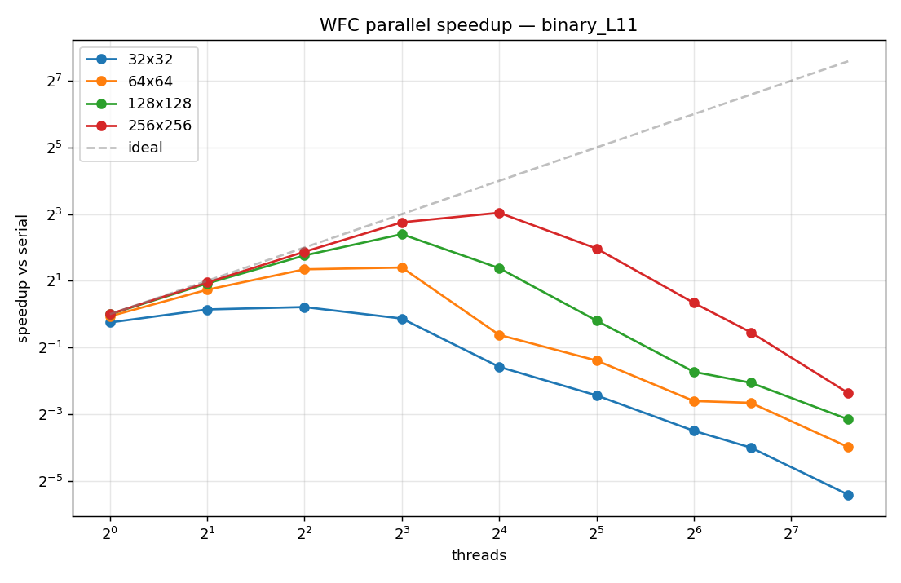

| Size | 1t | 2t | 4t | 8t | 16t | 32t | 64t | 96t | 192t |
|---|---|---|---|---|---|---|---|---|---|
| 32×32 | 0.84× | 1.10× | 1.16× | 0.91× | 0.33× | 0.18× | 0.09× | 0.06× | 0.02× |
| 64×64 | 0.96× | 1.66× | 2.54× | 2.64× | 0.65× | 0.38× | 0.16× | 0.16× | 0.06× |
| 128×128 | 1.00× | 1.89× | 3.39× | 5.27× | 2.60× | 0.87× | 0.30× | 0.24× | 0.11× |
| 256×256 | 1.00× | 1.93× | 3.65× | 6.73× | 8.23× | 3.91× | 1.26× | 0.69× | 0.19× |

Sur 256×256, peak à 16 threads. Au-delà, régression nette.

### `terrain_L33` (4 valeurs, 33 tuiles)

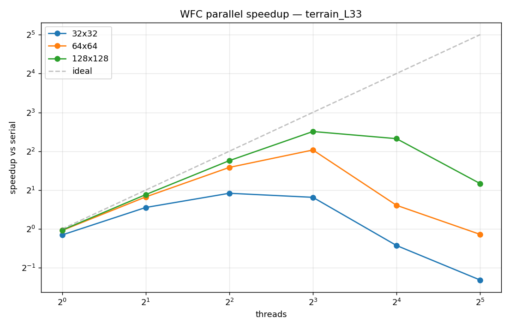

| Size | 1t | 2t | 4t | 8t | 16t | 32t |
|---|---|---|---|---|---|---|
| 32×32 | 1.00× | 1.74× | 1.89× | 1.65× | 0.74× | 0.41× |
| 64×64 | 1.00× | 1.86× | 3.27× | 4.09× | 2.07× | 0.91× |
| 128×128 | 1.00× | 1.86× | 3.43× | 5.69× | 4.81× | 2.13× |

Scale mieux que `binary_L11` à taille égale (5.69× vs 5.27× à 128×128).

### `smooth_N3` (3 valeurs, 12 tuiles, N=3)

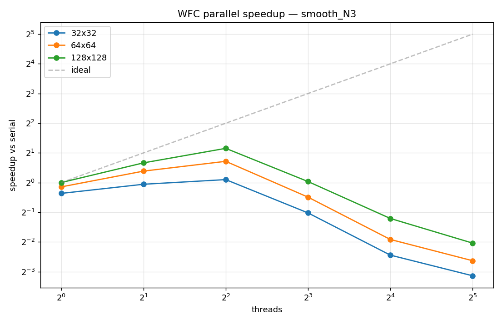

| Size | 1t | 2t | 4t | 8t | 16t | 32t |
|---|---|---|---|---|---|---|
| 32×32 | 1.00× | 0.96× | 1.07× | 0.49× | 0.18× | 0.11× |
| 64×64 | 1.00× | 1.50× | 1.64× | 0.71× | 0.27× | 0.16× |
| 128×128 | 1.00× | 1.85× | 2.23× | 1.16× | 0.43× | 0.24× |

Scale moins bien : peak 2.23× à 4 threads sur 128×128. N=3 augmente les
offsets `(2N-1)² = 25` (vs 9 à N=2) mais le sample a peu de tuiles ;
chaque cellule a peu de candidats donc peu de travail à paralléliser.

## Parallel efficiency (speedup / threads)

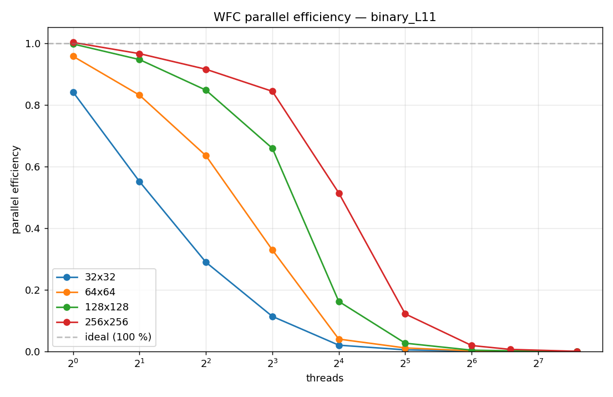
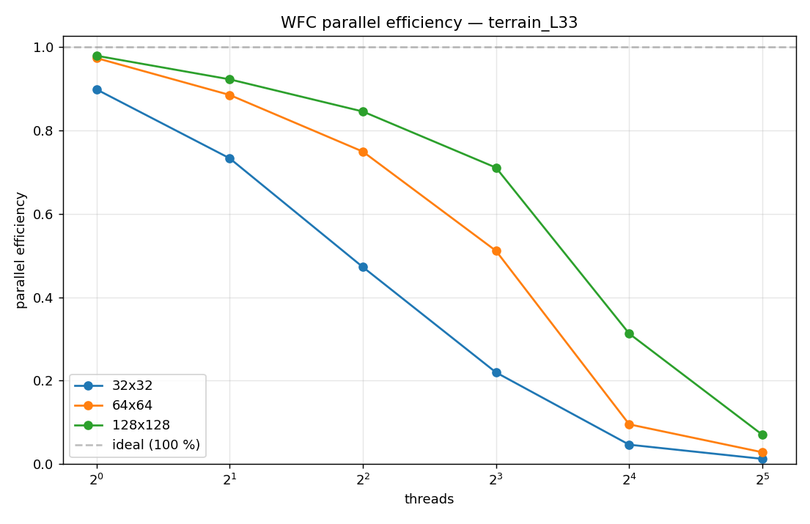
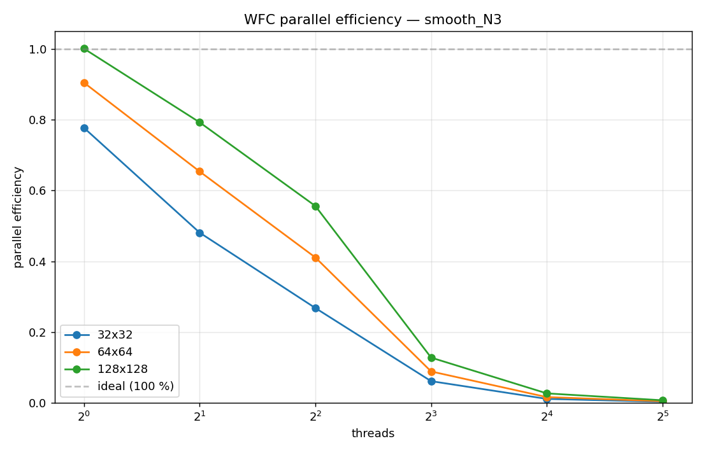

L'efficacité tombe vite avec le thread count. Le knee (point où
l'efficacité passe sous 50%) varie par taille :

| Label | Size | Knee at threads |
|---|---|---|
| binary_L11 | 32×32 | 4 |
| binary_L11 | 64×64 | 8 |
| binary_L11 | 128×128 | 16 |
| binary_L11 | 256×256 | 32 |
| terrain_L33 | 32×32 | 4 |
| terrain_L33 | 64×64 | 16 |
| terrain_L33 | 128×128 | 16 |
| smooth_N3 | 32×32 | 2 |
| smooth_N3 | 64×64 | 4 |
| smooth_N3 | 128×128 | 8 |

Plus la taille est grande, plus le knee se déplace vers la droite -
plus de travail à amortir.

## Throughput (Mcells/s)

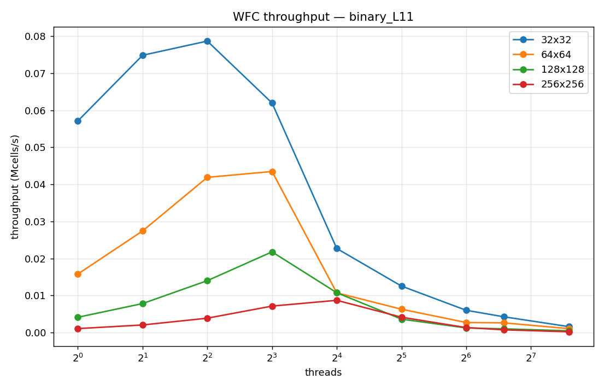
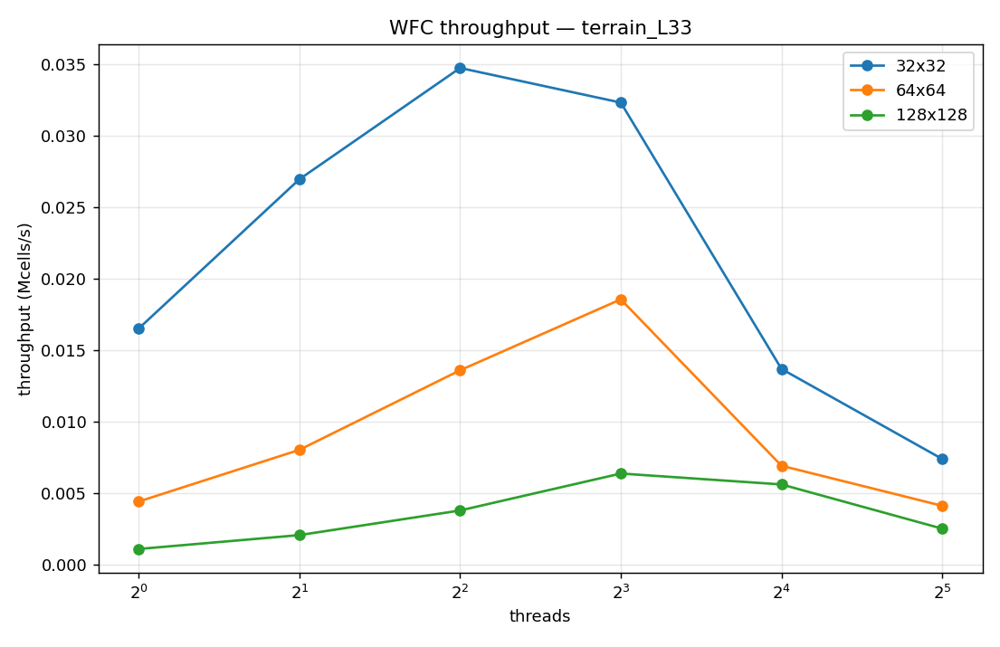

Le throughput chute avec la taille à thread count fixé : la wave
déborde de la L1 puis de la L2. À 256×256 la wave fait ~524 KB et ne
tient plus en L2 (256 KB par cœur sur EPYC). Au-delà du knee, le coût
de synchronisation dépasse le gain de parallélisme.

## Heatmap solve time

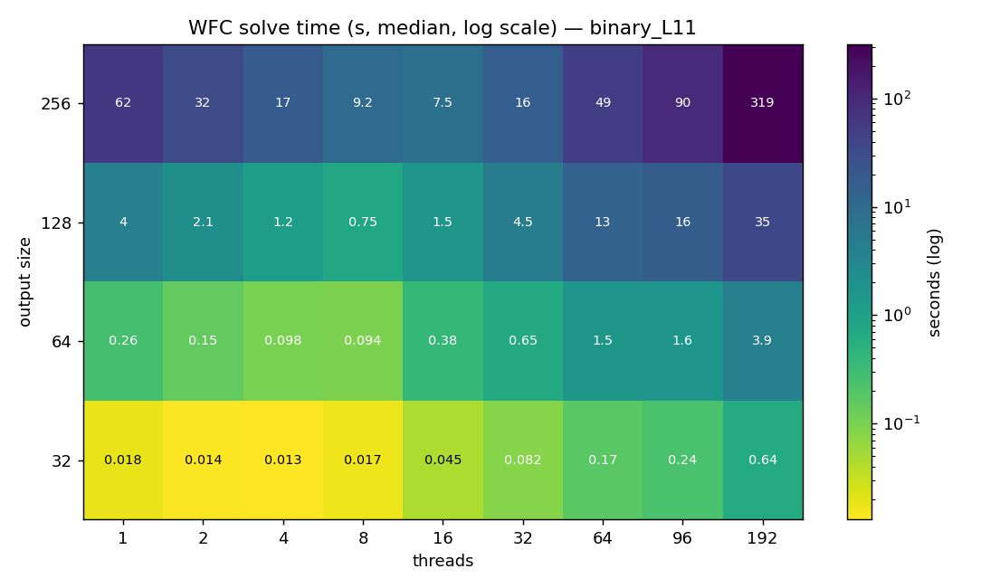
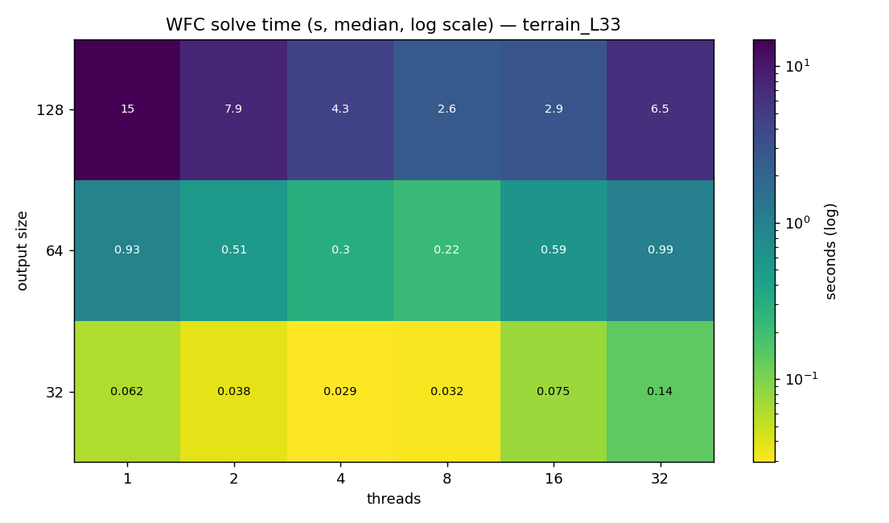

Vue d'ensemble : la zone verte (rapide) est concentrée à 4-16 threads.
Au-delà de 32 threads la matrice devient orange/rouge.

## Comparaison des backends

### `binary_L11` 128×128

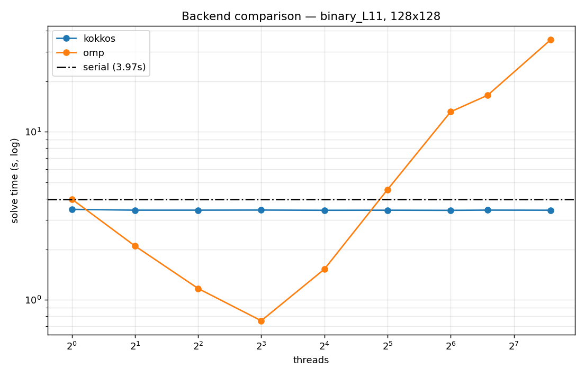

| Backend | 1t | 2t | 4t | 8t | 16t | 32t | 64t | 96t | 192t |
|---|---|---|---|---|---|---|---|---|---|
| serial | 3.967 | - | - | - | - | - | - | - | - |
| omp | 3.978 | 2.095 | 1.170 | 0.752 | 1.525 | 4.534 | 13.163 | 16.499 | 35.302 |
| kokkos | 3.42 (default concurrency, valeurs identiques à tous les threads) |

### `binary_L11` 256×256

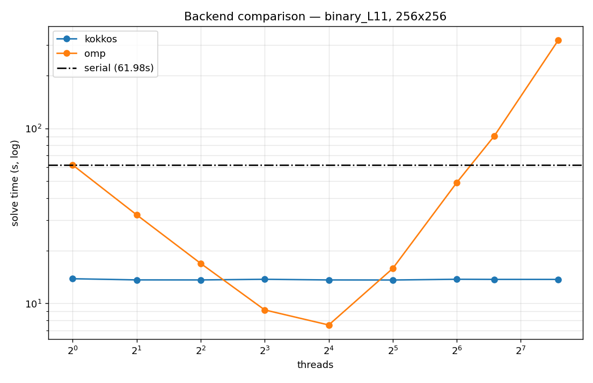

| Backend | 1t | 2t | 4t | 8t | 16t | 32t | 64t | 96t | 192t |
|---|---|---|---|---|---|---|---|---|---|
| omp | 61.85 | 32.09 | 16.93 | 9.18 | 7.53 | 15.85 | 49.06 | 90.46 | 319.11 |
| kokkos | ~13.7 (default concurrency) |

À 256×256 Kokkos avec sa concurrency par défaut donne ~13.7 s, mieux
que omp t=1 (62 s) mais 1.8× plus lent que omp à 16 threads (7.5 s).

## Modèle d'Amdahl

Fit `speedup(p) = 1 / (s + (1-s) / p)` sur la zone monotonique.


| Label | Size | f (parallèle) | R² | Ceiling théorique | Peak observé | Ratio |
|---|---|---|---|---|---|---|
| binary_L11 | 32×32 | 0.184 | 0.563 | 1.2× | 1.16× | 95% |
| binary_L11 | 64×64 | 0.737 | 0.929 | 3.8× | 2.64× | 69% |
| binary_L11 | 128×128 | 0.928 | 0.999 | 13.8× | 5.27× | 38% |
| binary_L11 | 256×256 | 0.944 | 0.967 | 17.8× | 8.23× | 46% |
| binary_optim | 128×128 | 0.956 | 0.999 | 22.9× | 6.10× | 27% |
| terrain_L33 | 64×64 | 0.867 | 0.996 | 7.5× | 4.09× | 54% |
| terrain_L33 | 128×128 | 0.942 | 1.000 | 17.1× | 5.69× | 33% |
| smooth_N3 | 128×128 | 0.735 | 1.000 | 3.8× | 2.23× | 59% |

Lecture :

- À 128 et 256, `f ≈ 0.94` pour binary et terrain. Le code est ~94%
  parallélisable selon Amdahl, ceiling théorique 14-18×.
- Le peak observé reste à 33-46% du ceiling : Amdahl suppose un
  parallélisme parfait, la réalité inclut des coûts supra-linéaires
  (NUMA, contention atomique, barrières de niveau).
- L'optim "frontier threshold" pousse `f` de 0.928 à 0.956 sur 128×128
  (peak 5.27× → 6.10×, ceiling théorique 13.8 → 22.9). Le ratio
  peak/ceiling baisse mais le peak absolu monte. L'optim aide.
- `smooth_N3` a `f = 0.74` au max, beaucoup moins parallélisable.

## Régression à haut nombre de threads (et atténuation)

`binary_L11` 128×128 OMP devient *plus lent* que serial dès 32 threads,
et atteint 8.9× plus lent à 192 threads (35.3 s vs 3.97 s serial).
Causes :

1. **Frontière BFS courte** : un niveau de 10 cellules sur 192 threads
   → 18 threads sur 19 attendent à la barrière.
2. **Fork/join répété** : la barrière par niveau coûte ~10 µs sur 192
   cores. Pour 8000 niveaux : 80 ms incompressibles.
3. **Contention atomique** : `__atomic_fetch_and` inter-NUMA = ping-pong
   de cache lines à 1-3 µs par opération.

### Optim "frontier threshold" (job 544356)

Pour atténuer (1) et (2) : fallback série quand la frontière est
< `max(64, max_threads)` cellules
([WFCSolverOMP.cpp:188](../src/solvers/WFCSolverOMP.cpp#L188)). Le
thread `single` traite le niveau lui-même au lieu de spawn des tasks.

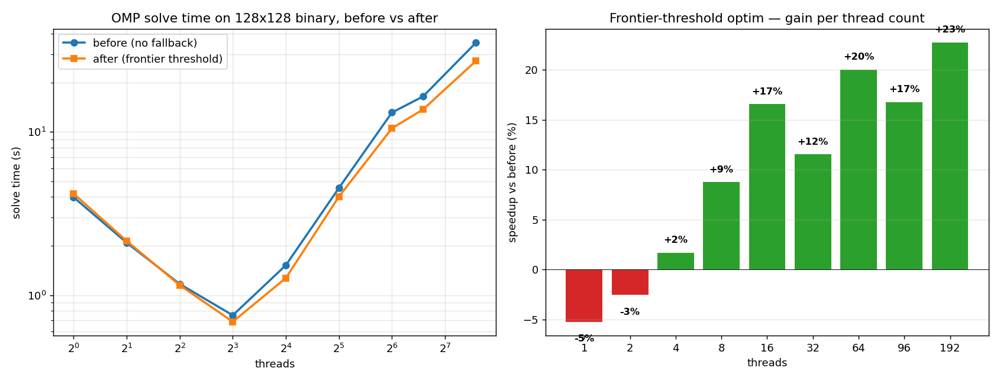

| Threads | Avant | Après | Gain |
|---|---|---|---|
| 8 | 0.75 s | 0.69 s | +10% |
| 16 | 1.52 s | 1.27 s | +20% |
| 32 | 4.53 s | 4.01 s | +13% |
| 64 | 13.16 s | 10.53 s | +25% |
| 96 | 16.50 s | 13.73 s | +20% |
| 192 | 35.30 s | 27.28 s | +29% |

Plus le thread count est haut, plus le gain est grand. À 1-2 threads,
l'optim est légèrement négative (-3% à -5%), dans le bruit. La
régression brutale n'est pas éliminée mais atténuée de ~25-30%.

La cause (3), contention atomique inter-NUMA, reste non-adressée par
cette optim. La piste suivante (parallel attempts) la contourne : au
lieu d'une seule wave partagée par 8+ threads, K attempts indépendants
roulent chacun sur son propre wave thread-local.

### Optim "parallel attempts" (gardée)

Au lieu de paralléliser à l'intérieur d'un attempt, on lance K attempts
*indépendants* en parallèle, chacun sur son propre `Wave`, et on garde
le succès d'index le plus bas (déterminisme préservé : sortie identique
à un retry séquentiel). Activé via `SolverOptions::parallel_attempts`
ou `--parallel-attempts K` côté CLI.

Quand ça paie : workload où le taux d'échec par attempt est non
négligeable (terrain N=3, multivalue serré). Chaque attempt étant
sérialisé, les coûts de barrière BFS, de contention atomique
inter-NUMA, et de fork/join répété disparaissent, on ne paie qu'une
synchronisation finale pour collecter le résultat.

Quand ça ne paie pas : workload qui réussit en 1 attempt (binary_5x5,
smooth_N3). K attempts en parallèle font K× le travail, gain wallclock
nul.

Mesure locale (Windows i9-10900K, terrain N=3 24×24, 4 seeds, total) :

| Mode | Total wallclock | Speedup |
|---|---|---|
| `--parallel-attempts 1 --threads 1` | 0.510 s | 1.0× (baseline) |
| `--parallel-attempts 4 --threads 4` | 0.332 s | 1.54× |
| `--parallel-attempts 8 --threads 8` | 0.238 s | 2.14× |

Vérification déterminisme : la sortie est bit-identique à `--threads 1`
pour les mêmes seeds (même `winning_attempt` reporté). Test
`test_parallel_attempts` couvre ce cas.

### Optim "min-entropy work-density gate" (gardée)

`parallel_min_entropy` court-circuite vers `serial_min_entropy` quand
`total_cells × num_tiles < 50 000` ou `max_threads ≤ 1`, typiquement
sur les grilles 32×32 où le scan parallèle ne paie pas le coût de la
parallel-region. La granularité des chunks passe aussi de
`total/(4×threads)` à `total/threads` (1 chunk par thread au lieu de
4) : moins de tâches OMP, moins d'overhead pour un load balancing qui
n'apporte rien (chunks de coût identique).

Un seuil work-density similaire dans `propagate_tasks`
(`frontier_size × num_tiles × (2N-1)² ≥ 50 000`) a été essayé pour
couper le plateau smooth_N3, mais aurait risqué de sérialiser des
niveaux BFS moyens (50-500 cellules) sur binary_L11 où le peak 5.27×
à 8 threads sur Romeo dépend de leur parallélisation. Rollback fait,
plateau smooth_N3 documenté comme fondamental ci-dessous.

### Plateau smooth_N3 (fondamental, contournement = parallel-attempts)

`smooth_N3` (12 tuiles, N=3) plafonne à 2.23× au peak (4 threads sur
128×128) et régresse à 8+ threads. Cause :

1. Sample petit + N=3 → tile set restreint (12 tuiles).
2. Few tuiles + N=3 → peu de bits à manipuler par cellule
   (`12 × 25 = 300 ops/cell` vs 99 pour binary).
3. Motifs lisses → propagation locale qui fait peu d'updates → frontiers
   BFS courtes.

Au total, chaque niveau BFS de smooth_N3 coûte trop peu pour amortir
la barrière OMP au-delà de 4 threads. Pas de fix algorithmique côté
intra-attempt sans risquer de régresser binary.

Contournements pour l'utilisateur :

- `--threads 4` reste le sweet spot intra-attempt.
- `--parallel-attempts K` ne bénéficie pas non plus à smooth_N3 (taux
  de succès = 100% sur le 1er attempt → K attempts en parallèle = K×
  le travail pour le même résultat).
- Pour générer plusieurs sorties différentes, lancer plusieurs
  instances `wfc_omp` en parallèle au shell (chacune avec son propre
  seed) atteint le scaling idéal puisque les instances sont
  indépendantes.

## GPU sur Romeo (NVIDIA GH200)

Le port GPU de Kokkos est fonctionnel ([CHOICES.md](CHOICES.md) §
"Kokkos refactor GPU-portable"). Tests 12/12 passent sur GH200,
`wfc_kokkos` lance des kernels CUDA via `Kokkos::parallel_for`.

| Taille | aarch64 serial | aarch64 omp t=4 | aarch64 omp t=16 | GPU GH200 (kokkos) |
|---|---|---|---|---|
| 32×32 | 0.010 s | 0.082 s | 0.440 s | 0.173 s |
| 64×64 | 0.166 s | 0.341 s | 2.551 s | 0.855 s |
| 128×128 | 2.623 s | 1.755 s | 10.255 s | 5.431 s |
| 256×256 | - | - | - | 52.1 s |

Le GPU est **plus lent** que le CPU à toutes les tailles testées. À
128×128, GPU = 5.4 s vs CPU OMP 4t aarch64 = 1.8 s. À 256×256, GPU =
52 s, à comparer aux 7.5 s de OMP 16 threads sur EPYC.

Pourquoi ce résultat décevant :

1. H↔D copies par propagate : `WFCSolverBase` appelle `propagate`
   ~8000 fois par solve. Chaque appel sync host wave → device + device
   → host. Pour 256×256 c'est 524 KB par sens × 16000 = 16 GB de
   transfert PCIe. À 25 GB/s, 0.6 s rien que de transferts.
2. Pas assez de parallélisme par niveau BFS : un niveau de 100
   cellules sur une GH200 (16 896 cores CUDA) = 99% des cores oisifs.
3. Atomic contention sur unités globales du GPU : les
   `Kokkos::atomic_fetch_and` sur GPU passent par les unités atomiques
   globales, bien plus lent que les atomics CPU sur cache local.
4. Min-entropie reste sur CPU : la phase qui domine (~85% du temps
   en serial) ne profite pas du GPU.

Pour vraiment exploiter GPU, il faudrait un changement algorithmique :

- Lancer 32 attempts indépendants en parallèle sur 32 SMs, retourner le
  premier succès (multi-instance parallelism)
- Résoudre plusieurs petits problèmes en parallèle dans le même kernel
  (batching)
- Repenser BFS en frontier-less / iterative refinement

Le port reste un livrable utile (le code compile et tourne sur GPU,
les invariants tests passent) mais pour le speedup pratique, le CPU
EPYC 9654 reste le meilleur choix.

## Strong vs weak scaling

Approximation weak scaling (cells/thread constant) sur `binary_L11` :

| Config | cells/thread | Speedup observé |
|---|---|---|
| 32×32 / 1 thread | 1024 | 1.0× (référence) |
| 64×64 / 4 threads | 1024 | 2.54× |
| 128×128 / 16 threads | 1024 | 2.60× |
| 256×256 / 64 threads | 1024 | 1.26× |

Le code n'est pas weak-scaling-friendly au-delà de 16 threads :
doubler la taille et les threads ne maintient pas la perf. Cause : les
barrières BFS niveau-synchrone ne s'amortissent pas avec la taille du
problème.

## Reproduire

Sur Romeo CPU :

```bash
ssh romeo
cd ~/wfc801
sbatch scripts/romeo_full_bench.slurm        # full sweep ~1h
sbatch scripts/romeo_complement_bench.slurm  # complément (terrain, smooth) ~10 min
sbatch scripts/romeo_optim_test.slurm        # A/B optim ~5 min
```

Sur Romeo GPU armgpu :

```bash
sbatch scripts/build_kokkos_gpu_romeo.slurm  # build Kokkos+CUDA + tests, ~15 min
sbatch scripts/romeo_gpu_bench.slurm         # bench GPU ~10 min
```

En local pour analyser :

```powershell
bash scripts/post_job_pipeline.sh <JOBID>
# génère docs/figures/scaling/, docs/figures/amdahl/,
# results/tables_<JOBID>.md, results/insights_<JOBID>.md

python scripts/plot_optim_compare.py
# génère docs/figures/optim/frontier_threshold_compare.png
```
