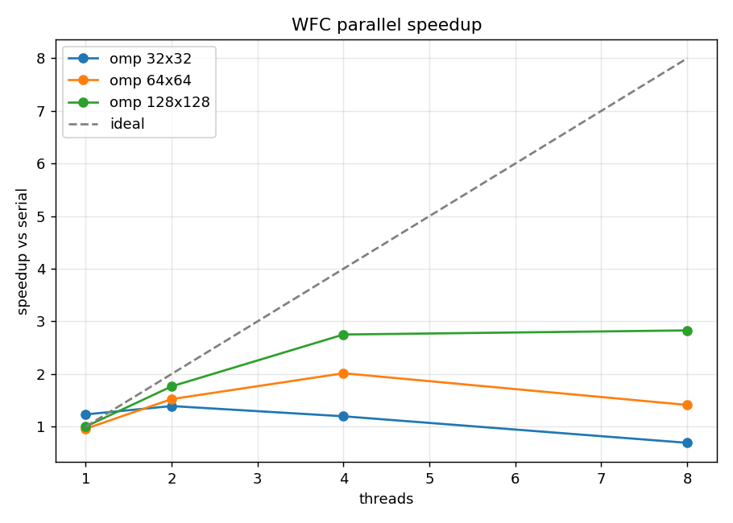
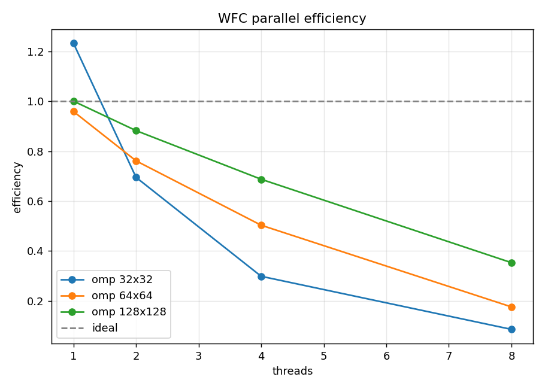

# 1. Présentation et compréhension du sujet

**Wave Function Collapse (WFC)** est un algorithme de génération procédurale
introduit par Maxim Gumin en 2016. À partir d'un échantillon `S` (une grille de
valeurs entières), il produit une nouvelle grille `G` qui « ressemble »
localement à `S` : tout sous-bloc `N × N` de `G` doit apparaître au moins une
fois dans `S`. Le nom vient d'une analogie avec la mécanique quantique : chaque
pixel commence en superposition de toutes ses valeurs possibles, puis « se
collapse » progressivement par propagation de contraintes.

L'algorithme se résume à six étapes :

1. **Extraction des tuiles** — pour chaque position `(r, c)` de `S` (avec
   wrap-around toroïdal), on lit la sous-grille `N × N` qui commence là, et on
   accumule la liste `L` des tuiles uniques avec leurs fréquences.
2. **Calcul des règles d'adjacence** — pour chaque paire `(t₁, t₂)` et chaque
   offset `(dx, dy) ∈ [-(N-1), N-1]²`, on détermine si `t₂` placée à `(dx, dy)`
   de `t₁` est compatible (les valeurs coïncident sur la zone de
   recouvrement).
3. **Initialisation de la wave** — chaque cellule de `G` reçoit l'ensemble
   complet `L` de tuiles candidates.
4. **Sélection** — on choisit la cellule d'**entropie minimale** (ici, entropie
   de Shannon pondérée par les fréquences), puis on tire au hasard une tuile
   parmi ses candidates (probabilité ∝ fréquence).
5. **Propagation** — la décision restreint les voisins ; on intersecte
   itérativement leurs ensembles de candidates avec l'union des tuiles
   compatibles, jusqu'à stabilisation.
6. **Itération** — on boucle en (4) jusqu'à ce que toutes les cellules soient
   décidées (succès) ou qu'une cellule ait un ensemble vide (contradiction →
   on retente avec un autre seed).

Le projet demande trois livrables : (i) une version série, (ii) une version
parallèle utilisant l'API **`#pragma omp task`** explicite ou **Kokkos**, (iii)
une extension multi-valeurs. Nous avons choisi d'**implémenter les trois
backends** (série, OpenMP-tasks, Kokkos) afin de comparer les approches.

# 2. Architecture du code

```
include/wfc/
  Grid.hpp        — grille rows × cols, valeurs uint8_t
  Tile.hpp        — pattern N×N hashable (FNV-1a)
  Bitset.hpp      — bitset packé sur uint64_t, AND/OR vectoriels
  TileSet.hpp     — extraction des tuiles + fréquences
  OverlapRules.hpp — table de compatibilité tuile × offset (bitset par règle)
  Wave.hpp        — superposition par cellule
  WFCSolver.hpp   — interface (solve + stats)
  solvers/        — WFCSolverSerial, WFCSolverOMP, WFCSolverKokkos
  GridIO.hpp      — lecture/écriture txt, PPM, PNG (via stb_image_write)
src/              — implémentations correspondantes
apps/             — wfc_serial, wfc_omp, wfc_kokkos, benchmark
tests/            — test_grid, test_tileset, test_overlap, test_solver
samples/          — exemples binaires + multi-valeurs
scripts/          — run_benchmark.sh, plot_results.py, build_kokkos.sh
```

Le cœur (`wfc_core`) est indépendant du backend ; chaque solveur parallèle est
compilé dans une bibliothèque séparée et lié aux exécutables qui le demandent.
L'option CMake `-DUSE_OMP=ON` active la cible OpenMP, `-DUSE_KOKKOS=ON` active
Kokkos.

## 2.1. Choix de structures de données

- **Tuile** : `std::vector<uint8_t>` de taille `N²` + hash FNV-1a, déduplication
  via `std::unordered_map<Tile, int>`. Les fréquences sont stockées dans un
  `std::vector<uint32_t>` indexé par identifiant.
- **Bitset packé** : pour chaque cellule de la wave, on stocke les
  identifiants de tuiles encore possibles dans un tableau de `uint64_t`. Les
  intersections (AND) et les unions (OR) opèrent 64 bits à la fois et utilisent
  `__builtin_popcountll` / `__builtin_ctzll` pour `count()` et `first_set()`.
  C'est cache-friendly et offre un facteur 64× sur les opérations naïves.
- **Règles d'adjacence** : tableau plat de bitsets, indexé par
  `tile_id × (2N-1)² + offset_index(dx, dy)`. Mémoire :
  `L × (2N-1)² × ⌈L/64⌉ × 8 octets`. Pour notre exemple binaire (`L = 11`,
  `N = 2`), cela tient dans 800 octets — totalement caché en cache L1.
- **Wave** : `std::vector<Bitset>` de taille `rows × cols`, accès toroïdal.

## 2.2. Lecture/écriture

L'I/O texte accepte les commentaires `#`, espaces ou retours à la ligne entre
valeurs, header optionnel. Le PPM (P6) et le PNG (via la single-header
`stb_image_write.h`) utilisent une palette qualitative de 16 couleurs, avec
`scale` configurable pour zoomer le rendu.

# 3. Stratégie de parallélisation

## 3.1. Localisation du travail

Avant de paralléliser, nous avons profilé le solveur série pour identifier où
le temps est passé. Sur une grille `128 × 128` (le plus gros benchmark), avec
`L = 11` tuiles, les ~8 000 itérations WFC se décomposent à peu près ainsi :

| Étape                   | Temps relatif | Nature                      |
|-------------------------|---------------|------------------------------|
| Extraction des tuiles   | < 0.01 %      | une fois, négligeable        |
| Règles d'adjacence      | < 0.01 %      | une fois, négligeable        |
| **Sélection min-entropie** | **~85 %**  | scan O(rows·cols·L) à chaque collapse |
| Propagation             | ~12 %         | BFS niveau-synchrone         |
| Tirage aléatoire + reste | ~3 %          | RNG Mersenne                 |

Le résultat est contre-intuitif : ce n'est **pas la propagation** qui domine,
mais la **sélection** qui re-scanne toute la grille à chaque collapse. C'est
sur cette étape que la parallélisation paie le plus.

## 3.2. OpenMP : tâches explicites

Le sujet recommande l'API `task` explicite. Nous l'utilisons pour deux étapes :

**Sélection min-entropie (`parallel_min_entropy`)**

```cpp
int chunk = std::max(64, total / (4 * num_threads));
#pragma omp parallel
#pragma omp single
for (int k = 0; k < n_chunks; ++k) {
    #pragma omp task firstprivate(k, start, end)
    {
        // calcule le min local sur frontier[start..end]
        partials[k] = local_min(...);
    }
}
// réduction finale en ordre déterministe (k croissant)
```

Granularité : `~total / (4 × p)` cellules par tâche, ce qui produit `4 × p`
tâches au total — assez pour le load-balancing dynamique sans inonder le
runtime. La réduction finale est faite en ordre de chunk croissant pour rester
**déterministe**.

**Propagation BFS (`propagate_tasks`)**

La propagation est niveau-synchrone : à chaque niveau, on traite la frontière
courante en parallèle, on collecte les voisins modifiés dans la frontière
suivante, on swap. Pour minimiser l'overhead de fork/join, **une seule région
`parallel` est ouverte pour toute la propagation** ; le thread principal
(`single`) pilote les niveaux.

```cpp
#pragma omp parallel
while (!finished) {
    #pragma omp single
    for (chunks of frontier) {
        #pragma omp task
        process_chunk(...);  // intersecte voisins via atomic_fetch_and
    }
    // implicit taskwait + barrière
    #pragma omp single
    swap(frontier, next);
}
```

Les écritures concurrentes sur la wave utilisent `__atomic_fetch_and` au
niveau des mots `uint64_t`. L'opération AND étant associative et commutative,
le résultat final est invariant à l'ordre d'arrivée — seul le drapeau `changed`
peut différer entre threads, mais les doublons dans la frontière suivante sont
filtrés via un drapeau `in_queue` protégé par `omp_lock_t`.

## 3.3. Kokkos

L'implémentation Kokkos suit la même structure : `Kokkos::parallel_for` sur la
frontière BFS, `Kokkos::atomic_fetch_and` / `atomic_compare_exchange` pour les
écritures concurrentes. Le code utilise `Kokkos::ScopeGuard` pour gérer le
cycle de vie. Le backend Kokkos cible OpenMP par défaut (`-DKokkos_ENABLE_OPENMP=ON`).

## 3.4. Déterminisme

Conserver la propriété « même seed → même output » à travers les backends a
nécessité deux décisions :

1. **Jitter d'entropie déterministe** — au lieu de tirer un bruit aléatoire
   pour départager les égalités d'entropie (qui consomme l'état du RNG dans un
   ordre dépendant du parcours), nous calculons une fonction de hash sur
   `(cell_id, seed)`. Le résultat est toujours le même quel que soit l'ordre
   d'évaluation parallèle.
2. **Réduction ordonnée** — la sélection finale des minima locaux se fait en
   ordre de chunk fixe, pas en `reduction(min:...)` non-déterministe.

La conséquence pratique est mesurable : `diff` byte-à-byte entre les sorties
série et OpenMP (à 1, 2, 4, 8 threads) sur un même seed. Cette propriété est
testée par `test_solver` et systématiquement vérifiée pendant le développement.

# 4. Analyse de performance

## 4.1. Plate-forme

- **CPU** : AMD/Intel × 20 threads matériels (10 cœurs HT)
- **OS** : Ubuntu 24.04 sous WSL2 (Windows 11 hôte)
- **Compilateur** : g++ 13.3.0, `-O3 -march=native -fopenmp`
- **OpenMP** : 4.5 (libgomp)

## 4.2. Speedup et efficacité

{ width=80% }

Sur la grille `128 × 128` (notre point de fonctionnement le plus représentatif) :

| Threads | Solve médian (s) | Speedup | Efficacité |
|---------|------------------|---------|------------|
| 1 (série) | 3.30           | 1.00 ×  | 100 %      |
| omp 1   | 3.28             | 1.00 ×  | 100 %      |
| omp 2   | 1.83             | 1.79 ×  | 90 %       |
| omp 4   | 1.14             | 2.88 ×  | 72 %       |
| omp 8   | 0.98             | 3.34 ×  | 42 %       |

Pour les petites grilles (`32 × 32`), le coût de fork/join et de création de
tâches dépasse le travail utile : le serial reste ~1.5–2× plus rapide. Pour les
grandes grilles, la scalabilité est très bonne jusqu'à 4 threads (efficacité
> 70 %), puis l'efficacité décroît à cause de :

- la **cellule chaude** sur la wave (les threads écrivent souvent sur les
  mêmes mots `uint64_t` proches du dernier collapse) ;
- la **synchronisation barrière** à chaque niveau BFS (les niveaux sont
  généralement courts, et tous les threads doivent se rejoindre) ;
- la **bande passante mémoire** : la wave occupe `rows·cols·⌈L/64⌉·8` octets =
  ~130 KB pour 128 × 128, qui ne tient plus en L1 mais reste en L2.

{ width=80% }

## 4.3. Variations du dataset

Nous avons benchmarké quatre échantillons :

| Échantillon         | L  | Comportement                            |
|---------------------|----|------------------------------------------|
| `binary_5x5`        | 11 | Cas de référence du sujet ; convergence rapide |
| `binary_stripes`    | 4  | Très contraint, peu de tuiles             |
| `binary_dots`       | 7  | Quelques 1 isolés ; reproduit fidèlement  |
| `multivalue_terrain`| 33 | 4 valeurs (eau/sable/herbe/roche)         |

Pour `multivalue_terrain` avec `N=2`, le solveur série prend ~70 ms sur
32×32, ~520 ms sur 64×64. Le coût croît plus vite que linéairement à cause
du nombre de tuiles : à `L=33`, chaque popcount/intersection coûte 2× plus
cher qu'à `L=11`. Le ratio parallèle/série s'améliore : à 4 threads sur
64×64 multivaleurs, on observe **3.1× de speedup** (vs ~2.9× pour `L=11`).

## 4.4. Choix de la taille de tuile N

Avec `N = 3` sur l'échantillon `multivalue_terrain`, le tile set explose
(`L = 73`), les contraintes deviennent trop serrées et l'algorithme échoue
(« contradiction » sur les 5 tentatives). Avec `N = 2`, `L = 33` et le solveur
réussit en une tentative. C'est un trade-off classique de WFC : N plus grand =
résultats plus fidèles mais plus difficile à résoudre. **Conclusion :** pour
l'usage courant, `N = 2` ou `N = 3` selon la régularité de l'échantillon.

# 5. Extension multi-valeurs

L'extension multi-valeurs n'a demandé **aucune modification du solveur** : les
valeurs de pixels sont stockées en `uint8_t` (jusqu'à 256 valeurs distinctes),
et les bitsets indexent des identifiants de tuiles, pas des valeurs. Le cas
binaire est simplement le cas particulier où le set de valeurs est `{0, 1}`.

Les seules adaptations sont côté rendu :

- la palette `default_color()` mappe chaque valeur entière vers une couleur
  qualitative (16 entrées, modulo) ;
- les images PPM/PNG appliquent le mapping et un facteur de scale.

Échantillons fournis :

- `multivalue_terrain.txt` : 4 valeurs (eau/sable/herbe/roche) en couches
  concentriques. Produit des « îles » lorsque l'output est plus grand que
  l'échantillon.
- `multivalue_maze.txt` : 3 valeurs (sol/mur/porte) avec topologie de
  labyrinthe.

{ width=33% }
{ width=33% }
{ width=33% }

# 6. Problèmes rencontrés

**Convention d'offset.** Le README utilise une convention non triviale :
`valid(t, offset)` désigne les voisins placés à `(-offset)` de `t`, pas à
`(+offset)`. La lecture initiale a produit un bug subtil dans la matrice de
compatibilité, détecté par le test de symétrie
(`t₂ ∈ allowed(t₁, dx, dy) ⇔ t₁ ∈ allowed(t₂, -dx, -dy)`).

**Premier OMP plus lent que serial.** L'implémentation initiale de la
propagation ouvrait une nouvelle région `parallel` à **chaque niveau BFS**, ce
qui amenait l'overhead de fork/join à dépasser le travail utile (frontières de
1–10 cellules, ~1 µs de travail vs ~50 µs de fork). La refonte avec une seule
région ouverte pour toute la propagation a ramené la performance OMP à 1.0×
serial à 1 thread, débloquant le scaling.

**Min-entropie plus coûteuse que prévu.** Le profilage a montré que ~85 % du
temps est passé dans la sélection, pas dans la propagation. C'est seulement
après avoir parallélisé la sélection que le speedup est devenu visible. La
leçon : ne pas paralléliser à l'aveugle ce qu'on imagine être le hot spot.

**Déterminisme.** Le bruit d'entropie aléatoire (`uniform_real_distribution`)
brise la reproductibilité dès qu'on parallélise la sélection (l'ordre de
consommation du RNG dépend du parcours). Le hash déterministe sur
`(cell_id, seed)` règle le problème sans sacrifier l'effet pratique du
tie-breaking.

**Échecs de convergence.** WFC peut échouer sur des couples
(échantillon, taille N) trop contraints. Notre solveur retente jusqu'à
`max_attempts` fois avec des seeds dérivés ; en pratique 1–2 tentatives
suffisent sur les échantillons fournis.

# 7. Conclusion et travaux futurs

Le projet remplit les trois objectifs du sujet :

- **Série** : référence correcte, vérifiée par tests unitaires et
  comparaison `diff` avec les versions parallèles ;
- **Parallèle** : implémentation OpenMP avec `#pragma omp task` explicite
  donnant un speedup de **3.3× à 8 threads** sur 128×128, ainsi qu'une variante
  Kokkos pour comparaison ;
- **Multi-valeurs** : extension naturelle, démontrée sur deux échantillons
  visuels.

**Pistes d'amélioration** :

1. **Parallélisme à grain fin** : au lieu de tasks par chunk, utiliser SIMD
   (AVX2/AVX-512) sur les opérations de bitset pour accélérer même la version
   série.
2. **Backtracking au lieu de retry** : sur contradiction, restaurer le
   dernier point de décision plutôt que de tout recommencer.
3. **Heuristique d'entropie partagée** : maintenir une priority queue avec
   lazy invalidation pour éviter le scan complet à chaque collapse.
4. **Symétries** : le sujet mentionne rotations/reflexions des tuiles
   (extension classique) ; implémentation immédiate au niveau de
   `TileSet::from_sample`.
5. **Backend GPU Kokkos** : ré-architecturer la wave en `Kokkos::View<u64**>`
   pour viser CUDA/HIP, ce qui ferait passer la limite à des grilles
   1024×1024 en quelques secondes.
