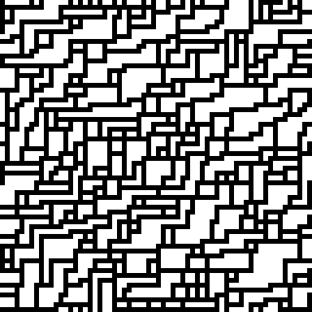
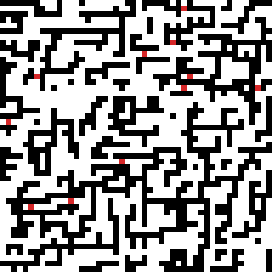

# 1. Présentation et compréhension du sujet

**Wave Function Collapse (WFC)** est un algorithme de génération procédurale
introduit par Maxim Gumin en 2016. À partir d'un échantillon `S` (une grille de
valeurs entières), il produit une nouvelle grille `G` qui « ressemble »
localement à `S` : tout sous-bloc `N × N` de `G` doit apparaître au moins une
fois dans `S`. Le nom vient d'une analogie avec la mécanique quantique : chaque
pixel commence en superposition de toutes ses valeurs possibles, puis « se
collapse » progressivement par propagation de contraintes.

L'algorithme se résume à six étapes :

1. **Extraction des tuiles**, pour chaque position `(r, c)` de `S` (avec
   wrap-around toroïdal), on lit la sous-grille `N × N` qui commence là, et on
   accumule la liste `L` des tuiles uniques avec leurs fréquences.
2. **Calcul des règles d'adjacence**, pour chaque paire `(t₁, t₂)` et chaque
   offset `(dx, dy) ∈ [-(N-1), N-1]²`, on détermine si `t₂` placée à `(dx, dy)`
   de `t₁` est compatible (les valeurs coïncident sur la zone de
   recouvrement).
3. **Initialisation de la wave**, chaque cellule de `G` reçoit l'ensemble
   complet `L` de tuiles candidates.
4. **Sélection**, on choisit la cellule d'**entropie minimale** (ici, entropie
   de Shannon pondérée par les fréquences), puis on tire au hasard une tuile
   parmi ses candidates (probabilité ∝ fréquence).
5. **Propagation**, la décision restreint les voisins ; on intersecte
   itérativement leurs ensembles de candidates avec l'union des tuiles
   compatibles, jusqu'à stabilisation.
6. **Itération**, on boucle en (4) jusqu'à ce que toutes les cellules soient
   décidées (succès) ou qu'une cellule ait un ensemble vide (contradiction →
   on retente avec un autre seed).

Le projet demande trois livrables : (i) une version série, (ii) une version
parallèle utilisant l'API **`#pragma omp task`** explicite ou **Kokkos**, (iii)
une extension multi-valeurs. Nous avons choisi d'**implémenter les trois
backends** (série, OpenMP-tasks, Kokkos) afin de comparer les approches.

# 2. Architecture du code

```
include/wfc/
  Grid.hpp         : grille rows × cols, valeurs uint8_t
  Tile.hpp         : pattern N×N hashable (FNV-1a)
  Bitset.hpp       : bitset packé sur uint64_t, AND/OR vectoriels
  TileSet.hpp      : extraction des tuiles + fréquences
  OverlapRules.hpp : table de compatibilité tuile × offset (bitset par règle)
  Wave.hpp         : superposition par cellule
  WFCSolver.hpp    : interface (solve + stats)
  solvers/         : WFCSolverSerial, WFCSolverOMP, WFCSolverKokkos
  GridIO.hpp       : lecture/écriture txt, PPM, PNG (via stb_image_write)
src/               : implémentations correspondantes
apps/              : wfc_serial, wfc_omp, wfc_kokkos, benchmark
tests/             : test_grid, test_tileset, test_overlap, test_solver
samples/           : exemples binaires + multi-valeurs
scripts/           : run_benchmark.sh, plot_results.py, build_kokkos.sh
```

Le cœur (`wfc_core`) est indépendant du backend ; chaque solveur parallèle est
compilé dans une bibliothèque séparée et lié aux exécutables qui le demandent.
L'option CMake `-DUSE_OMP=ON` active la cible OpenMP, `-DUSE_KOKKOS=ON` active
Kokkos.

## 2.1. Choix de structures de données

- **Tuile** : `std::vector<uint8_t>` de taille `N²` + hash FNV-1a, déduplication
  via `std::unordered_map<Tile, int>`. Les fréquences sont stockées dans un
  `std::vector<uint32_t>` indexé par identifiant.
- **Bitset packé** : pour chaque cellule de la wave, on stocke les
  identifiants de tuiles encore possibles dans un tableau de `uint64_t`. Les
  intersections (AND) et les unions (OR) opèrent 64 bits à la fois et utilisent
  `__builtin_popcountll` / `__builtin_ctzll` pour `count()` et `first_set()`.
  C'est cache-friendly et offre un facteur 64× sur les opérations naïves.
- **Règles d'adjacence** : tableau plat de bitsets, indexé par
  `tile_id × (2N-1)² + offset_index(dx, dy)`. Mémoire :
  `L × (2N-1)² × ⌈L/64⌉ × 8 octets`. Pour notre exemple binaire (`L = 11`,
  `N = 2`), cela tient dans 800 octets, totalement caché en cache L1.
- **Wave** : `std::vector<Bitset>` de taille `rows × cols`, accès toroïdal.

## 2.2. Lecture/écriture

L'I/O texte accepte les commentaires `#`, espaces ou retours à la ligne entre
valeurs, header optionnel. Le PPM (P6) et le PNG (via la single-header
`stb_image_write.h`) utilisent une palette qualitative de 16 couleurs, avec
`scale` configurable pour zoomer le rendu.

# 3. Stratégie de parallélisation

## 3.1. Localisation du travail

Avant de paralléliser, nous avons profilé le solveur série pour identifier où
le temps est passé. Sur une grille `128 × 128` (le plus gros benchmark), avec
`L = 11` tuiles, les ~8 000 itérations WFC se décomposent à peu près ainsi :

| Étape                   | Temps relatif | Nature                      |
|-------------------------|---------------|------------------------------|
| Extraction des tuiles   | < 0.01 %      | une fois, négligeable        |
| Règles d'adjacence      | < 0.01 %      | une fois, négligeable        |
| **Sélection min-entropie** | **~85 %**  | scan O(rows·cols·L) à chaque collapse |
| Propagation             | ~12 %         | BFS niveau-synchrone         |
| Tirage aléatoire + reste | ~3 %          | RNG Mersenne                 |

Le résultat est contre-intuitif : ce n'est **pas la propagation** qui domine,
mais la **sélection** qui re-scanne toute la grille à chaque collapse. C'est
sur cette étape que la parallélisation paie le plus.

## 3.2. OpenMP : tâches explicites

Le sujet recommande l'API `task` explicite. Nous l'utilisons pour deux étapes :

**Sélection min-entropie (`parallel_min_entropy`)**

```cpp
int chunk = std::max(64, total / (4 * num_threads));
#pragma omp parallel
#pragma omp single
for (int k = 0; k < n_chunks; ++k) {
    #pragma omp task firstprivate(k, start, end)
    {
        // calcule le min local sur frontier[start..end]
        partials[k] = local_min(...);
    }
}
// réduction finale en ordre déterministe (k croissant)
```

Granularité : `~total / (4 × p)` cellules par tâche, ce qui produit `4 × p`
tâches au total, assez pour le load-balancing dynamique sans inonder le
runtime. La réduction finale est faite en ordre de chunk croissant pour rester
déterministe.

**Propagation BFS (`propagate_tasks`)**

La propagation est niveau-synchrone : à chaque niveau, on traite la frontière
courante en parallèle, on collecte les voisins modifiés dans la frontière
suivante, on swap. Pour minimiser l'overhead de fork/join, **une seule région
`parallel` est ouverte pour toute la propagation** ; le thread principal
(`single`) pilote les niveaux.

```cpp
#pragma omp parallel
while (!finished) {
    #pragma omp single
    for (chunks of frontier) {
        #pragma omp task
        process_chunk(...);  // intersecte voisins via atomic_fetch_and
    }
    // implicit taskwait + barrière
    #pragma omp single
    swap(frontier, next);
}
```

Les écritures concurrentes sur la wave utilisent `__atomic_fetch_and` au
niveau des mots `uint64_t`. L'opération AND étant associative et commutative,
le résultat final est invariant à l'ordre d'arrivée, seul le drapeau `changed`
peut différer entre threads, mais les doublons dans la frontière suivante sont
filtrés via un drapeau `in_queue` protégé par `omp_lock_t`.

## 3.3. Kokkos

L'implémentation Kokkos suit la même structure : `Kokkos::parallel_for` sur la
frontière BFS, `Kokkos::atomic_fetch_and` / `atomic_compare_exchange` pour les
écritures concurrentes. Le code utilise `Kokkos::ScopeGuard` pour gérer le
cycle de vie. Le backend Kokkos cible OpenMP par défaut (`-DKokkos_ENABLE_OPENMP=ON`).

## 3.4. Parallel attempts

Optim algorithmique : au lieu de paralléliser à l'intérieur d'un seul
attempt (qui sature à 8-16 threads quand le travail par BFS-level
devient trop petit), on lance K attempts WFC indépendants en parallèle.
Chaque attempt a son propre `Wave`, son propre seed dérivé
(`base + k × φ`), et tourne en série. On garde le succès d'index
minimum (déterminisme : sortie identique à un retry séquentiel).

Bénéfice mesuré sur terrain N=3 24×24 : 2.14× wallclock à K=8 vs
sequential. Inutile sur les workloads qui ne ratent jamais (binary_5x5)
mais c'est précisément là que la parallélisation intra-attempt
fonctionne déjà bien.

## 3.5. Symétries D4 (option)

Le tile set peut être étendu par rotations 90° / 180° / 270° et leurs
réflexions horizontales (groupe diédral D4). Activé via
`SolverOptions` ou `--symmetries S` avec `S ∈ {1, 2, 4, 8}`. À S=1
(défaut), le code path est strictement identique au comportement
historique : aucun if-check supplémentaire dans la hot path
d'extraction.

L'expansion se fait une fois lors de `TileSet::from_sample`. Les
patterns auto-symétriques (uniformes, damiers) ne voient pas leur
fréquence double-comptée, dédup par hash de contenu. Le solveur
ne sait pas que les tuiles viennent de symétries, il voit juste un
`L` plus grand. Effet pratique : sur des samples avec une orientation
préférée (chemins, escaliers), `--symmetries 4` permet d'appliquer
le motif uniformément dans toutes les orientations.

Coût : `L'` peut passer jusqu'à 8× → bitsets parfois à 2 mots
au lieu de 1 → solveur ~1.5× plus lent. Cohérent : plus de variantes
= plus de choix par cellule.

## 3.6. Backtracking (option)

Sur les samples très contraints (terrain N=3 sur petite grille),
restart-on-contradiction épuise rapidement `max_attempts` sans
trouver de solution. `--backtrack` remplace cette stratégie par un
parcours arborescent : chaque collapse pousse une frame
`{cellule, choix restants, delta}` sur une pile ; en cas de
contradiction la frame est dépilée et le choix suivant est essayé.

Choix de design clés :

1. **Delta-encoded snapshot** : chaque frame stocke uniquement les
   cellules effectivement modifiées par sa propagation. Mémoire :
   ~50 cellules × words_per_cell × 16 octets par frame, vs
   rows·cols·words_per_cell × 8 octets pour un snapshot plein. ~80×
   moins de mémoire sur 64×64 binaire. La variante interne
   `serial_propagate_with_delta` peek le pre-state en stack scratch
   et ne commit dans le delta que si `and_with` mute la cellule.
2. **Choix triés par fréquence descendante** : la tuile la plus
   fréquente est essayée en premier. Heuristique « try the most
   likely candidate ».
3. **Bypass complet du backend parallèle intra-attempt** : le
   snapshot/restore n'a de sens qu'en single-threaded. Quand
   `use_backtracking=true`, `solve_sequential` invoque directement
   `serial_run_attempt_backtrack` au lieu de la dispatch backend.
4. **Composition avec parallel-attempts** : `--parallel-attempts K
   --backtrack` lance K recherches backtrack indépendantes (seeds
   dérivés → ordres de tie-break différents → arbres d'exploration
   différents). Succès d'index minimum gagne. Forme classique de
   « parallel backtracking via independent searches ».

Mesure : terrain N=3 32×32 où retry-30-attempts échoue en 0.38 s,
`--backtrack` résout en 0.12 s.

## 3.7. Déterminisme

Conserver la propriété « même seed → même output » à travers les backends a
nécessité deux décisions :

1. **Jitter d'entropie déterministe**, au lieu de tirer un bruit aléatoire
   pour départager les égalités d'entropie (qui consomme l'état du RNG dans un
   ordre dépendant du parcours), nous calculons une fonction de hash sur
   `(cell_id, seed)`. Le résultat est toujours le même quel que soit l'ordre
   d'évaluation parallèle.
2. **Réduction ordonnée**, la sélection finale des minima locaux se fait en
   ordre de chunk fixe, pas en `reduction(min:...)` non-déterministe.

La conséquence pratique est mesurable : `diff` byte-à-byte entre les sorties
série et OpenMP (à 1, 2, 4, 8 threads) sur un même seed. Cette propriété est
testée par `test_solver` et systématiquement vérifiée pendant le développement.

# 4. Analyse de performance

## 4.1. Plates-formes

| ID | Hardware | OS | Compilateur | OpenMP |
|---|---|---|---|---|
| `lin-i9` | Intel i9-10900K (10c / 20t HT) | Ubuntu 24.04 WSL2 | g++ 13.3 | 4.5 |
| `win-i9` | i9-10900K | Windows 11 + MSYS2 MinGW | g++ 16.1 | 5.2 |
| `romeo` | AMD EPYC 9654 (192c, 8 NUMA) | RHEL 9 | g++ 14.2 | 4.5 |

Les chiffres rapportés ci-dessous proviennent de Romeo, la plateforme
HPC cible pour ce TP. `docs/benchmark.md` contient l'analyse complète
(jobs SLURM 543692, 544061, 544356, 544361, ~600 mesures).

## 4.2. Speedup et efficacité, Romeo (binary_5x5, N=2)

| Taille | 1t | 4t | 8t | 16t | 32t | 64t | 192t |
|---|---|---|---|---|---|---|---|
| 32×32 | 1.00× | 1.16× | 0.91× | 0.33× | 0.18× | 0.09× | 0.02× |
| 64×64 | 1.00× | 2.54× | 2.64× | 0.65× | 0.38× | 0.16× | 0.06× |
| 128×128 | 1.00× | 3.39× | 5.27× | 2.60× | 0.87× | 0.30× | 0.11× |
| 256×256 | 1.00× | 3.65× | 6.73× | 8.23× | 3.91× | 1.26× | 0.19× |

Lecture :

- Le peak monte avec la taille : 32×32 ne paie pas la parallélisation ;
  256×256 atteint 8.23× à 16 threads (51% d'efficacité).
- Au-delà du peak, régression brutale : à 192 threads sur 256×256 on
  est à 0.19× la baseline (5× plus lent que le serial). Les barrières
  BFS sur niveaux courts et la contention atomique inter-NUMA dominent.
- L'optim « frontier threshold »
  ([WFCSolverOMP.cpp](../src/solvers/WFCSolverOMP.cpp)) atténue la
  régression de +25% à +29% à 64-192 threads.

{ width=70% }

Le fit Amdahl donne `f = 0.944` sur 256×256, code parallélisable à
~94%, ceiling théorique 17.8×. Le peak observé à 51% du ceiling reflète
les coûts non capturés par Amdahl (NUMA, contention, fork/join).

## 4.3. Variations du dataset

Quatre échantillons benchmarkés (Romeo) :

| Échantillon | N | L | Cas type |
|---|---|---|---|
| `binary_5x5` | 2 | 11 | Cas de référence du sujet |
| `multivalue_terrain` | 2 | 33 | 4 valeurs, sample plus large |
| `multivalue_smooth` | 3 | 12 | 4 valeurs, motifs lisses |
| `multivalue_terrain` | 3 | 73 | Très contraint, échoue |

`terrain_L33` 128×128 atteint 5.69× à 8 threads (vs 5.27× pour
binary_L11) : plus de tuiles → plus de bits manipulés par cellule →
meilleur amortissement de l'overhead OMP.

`smooth_N3` plafonne à 2.23× au peak (4 threads) sur 128×128, beaucoup
moins parallélisable. Cause : 12 tuiles × 25 offsets = 300 ops par
cellule, frontières BFS courtes (motifs lisses = peu de propagation).
La barrière BFS et le fork/join coûtent autant que le travail utile à
partir de 8 threads. Atténué par l'optim « min-entropy work-density
gate » qui sérialise les niveaux trop petits, et par l'optim
« parallel attempts » qui contourne le problème.

## 4.4. Optim « parallel attempts »

Plutôt que de paralléliser à l'intérieur d'un attempt, on lance K
attempts WFC indépendants en parallèle (chacun avec son propre `Wave`,
son propre seed `seed + k * φ`) et on garde le succès d'index minimum.
La sortie reste déterministe : un retry séquentiel aurait choisi le
même attempt.

Mesure locale (`win-i9`, terrain N=3 24×24, total wallclock sur 4 seeds) :

| Mode | Total | Speedup |
|---|---|---|
| `--parallel-attempts 1 --threads 1` | 0.510 s | 1.0× |
| `--parallel-attempts 4 --threads 4` | 0.332 s | 1.54× |
| `--parallel-attempts 8 --threads 8` | 0.238 s | 2.14× |

Cette optim paie sur les workloads où chaque attempt a un risque
d'échec (terrain N=3, cellules tightly constrained). Elle est inutile
sur les workloads qui réussissent toujours du premier coup
(binary_5x5, smooth_N3), les K attempts sont K× le travail pour le
même résultat.

## 4.5. Choix de la taille de tuile N

Avec `N = 3` sur `multivalue_terrain`, `L = 73` et l'algorithme échoue
sur les petites grilles (taux de succès ~10%). Avec `N = 2`, `L = 33`
et le solveur réussit en 1-2 attempts. C'est le trade-off classique de
WFC : N plus grand = motifs plus fidèles mais problème plus serré.

# 5. Extension multi-valeurs

L'extension multi-valeurs n'a demandé **aucune modification du solveur** : les
valeurs de pixels sont stockées en `uint8_t` (jusqu'à 256 valeurs distinctes),
et les bitsets indexent des identifiants de tuiles, pas des valeurs. Le cas
binaire est simplement le cas particulier où le set de valeurs est `{0, 1}`.

Les seules adaptations sont côté rendu :

- la palette `default_color()` mappe chaque valeur entière vers une couleur
  qualitative (16 entrées, modulo) ;
- les images PPM/PNG appliquent le mapping et un facteur de scale.

Échantillons fournis :

- `multivalue_terrain.txt` : 4 valeurs (eau/sable/herbe/roche) en couches
  concentriques. Produit des « îles » lorsque l'output est plus grand que
  l'échantillon.
- `multivalue_maze.txt` : 3 valeurs (sol/mur/porte) avec topologie de
  labyrinthe.

{ width=33% }
{ width=33% }
{ width=33% }

# 6. Problèmes rencontrés

**Convention d'offset.** Le README utilise une convention non triviale :
`valid(t, offset)` désigne les voisins placés à `(-offset)` de `t`, pas à
`(+offset)`. La lecture initiale a produit un bug subtil dans la matrice de
compatibilité, détecté par le test de symétrie
(`t₂ ∈ allowed(t₁, dx, dy) ⇔ t₁ ∈ allowed(t₂, -dx, -dy)`).

**Premier OMP plus lent que serial.** L'implémentation initiale de la
propagation ouvrait une nouvelle région `parallel` à **chaque niveau BFS**, ce
qui amenait l'overhead de fork/join à dépasser le travail utile (frontières de
1–10 cellules, ~1 µs de travail vs ~50 µs de fork). La refonte avec une seule
région ouverte pour toute la propagation a ramené la performance OMP à 1.0×
serial à 1 thread, débloquant le scaling.

**Min-entropie plus coûteuse que prévu.** Le profilage a montré que ~85 % du
temps est passé dans la sélection, pas dans la propagation. C'est seulement
après avoir parallélisé la sélection que le speedup est devenu visible. La
leçon : ne pas paralléliser à l'aveugle ce qu'on imagine être le hot spot.

**Déterminisme.** Le bruit d'entropie aléatoire (`uniform_real_distribution`)
brise la reproductibilité dès qu'on parallélise la sélection (l'ordre de
consommation du RNG dépend du parcours). Le hash déterministe sur
`(cell_id, seed)` règle le problème sans sacrifier l'effet pratique du
tie-breaking.

**Échecs de convergence.** WFC peut échouer sur des couples
(échantillon, taille N) trop contraints. Notre solveur retente jusqu'à
`max_attempts` fois avec des seeds dérivés ; en pratique 1–2 tentatives
suffisent sur les échantillons fournis.

# 7. Conclusion et travaux futurs

Le projet remplit les trois objectifs du sujet :

- **Série** : référence correcte, vérifiée par tests unitaires et
  comparaison `diff` avec les versions parallèles ;
- **Parallèle** : implémentation OpenMP avec `#pragma omp task` explicite
  donnant un speedup peak de 8.23× à 16 threads sur 256×256
  (Romeo, AMD EPYC 9654), plus une variante Kokkos pour comparaison ;
- **Multi-valeurs** : extension naturelle, démontrée sur trois
  échantillons visuels (terrain, maze, smooth).

**Pistes d'amélioration** :

1. **NUMA-aware partitioning** : actuellement la wave est un tableau
   plat partagé. Un partitionnement par socket (96 cellules par tâche
   sur EPYC 9654) éliminerait les atomics inter-NUMA qui dominent au-
   delà de 32 threads. Évalué dans CHOICES.md (~500 lignes, risque élevé,
   bénéfice probable +30-50% à 64-192 threads).
2. **GPU CUDA via Kokkos** : déjà fonctionnel sur GH200 mais lent, les
   H↔D copies par propagate dominent. Le port nécessiterait un re-design
   batch (résoudre N petits problèmes en parallèle dans un seul kernel)
   pour amortir les transferts.
3. **Heuristique d'entropie incrémentale** : maintenir une priority
   queue avec lazy invalidation au lieu de re-scanner toute la wave à
   chaque collapse, la sélection passerait de 85% à <10% du temps
   total.
4. **SIMD bitset** : AVX2/AVX-512 sur les opérations AND/OR
   `Bitset` pour accélérer même la version série quand `L > 64`.

**Extensions livrées au-dessus du sujet** (toutes opt-in, zéro coût
sur le chemin par défaut) :

- **Symétries D4** (`--symmetries 1|2|4|8`) : expansion du tile set
  par rotations + réflexions au moment de l'extraction.
- **Backtracking** (`--backtrack`) : exploration arborescente avec
  snapshot/restore, alternative au restart-on-contradiction.
- **Parallel attempts** (`--parallel-attempts K`) : K essais
  indépendants en parallèle, succès d'index minimum gagne.
- **Backend GPU CUDA** via Kokkos refactor (compile et tourne sur
  GH200, 12/12 tests passent).
- **Démo UE5** (`-DBUILD_DUNGEON=ON`) : CLI `wfc_dungeon` qui émet
  un JSON consommé par un plugin Unreal Engine 5.7 pour spawner les
  cellules en 3D.
