# Galerie d'images générées

Échantillons d'entrée et grilles générées par le solveur sur la machine
locale (i9-10900K, MinGW UCRT g++ 16.1, USE_LTO=ON). Images produites
par le binaire `wfc_serial`, rendu PNG via `stb_image_write.h`. La
palette 16 couleurs est définie dans
[GridIO.cpp:67-87](../src/GridIO.cpp#L67-L87).

Pour reproduire :

```powershell
.\build\wfc_serial.exe samples/<sample>.txt --rows N --cols N -N 2 \
    --seed S --scale K --png out.png
```

## Légende des couleurs

| Valeur | Couleur          | Hex      |
|--------|------------------|----------|
| 0      | Noir             | `#000000` |
| 1      | Blanc            | `#ffffff` |
| 2      | Bleu eau         | `#1f77b4` |
| 3      | Orange sable     | `#ff7f0e` |
| 4      | Vert herbe       | `#2ca02c` |
| 5      | Violet roche     | `#9467bd` |
| 6      | Rouge porte      | `#d62728` |
| 7      | Marron           | `#8c564b` |
| 8+     | tons clairs      | (cf. palette) |

## Échantillons binaires

### `binary_5x5`, l'exemple du sujet

Sample 5×5 du `README.pdf`. Donne 11 tuiles uniques avec N=2.

| Input (5×5) | Output 64×64 N=2 seed=42 |
|---|---|
| 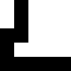 | 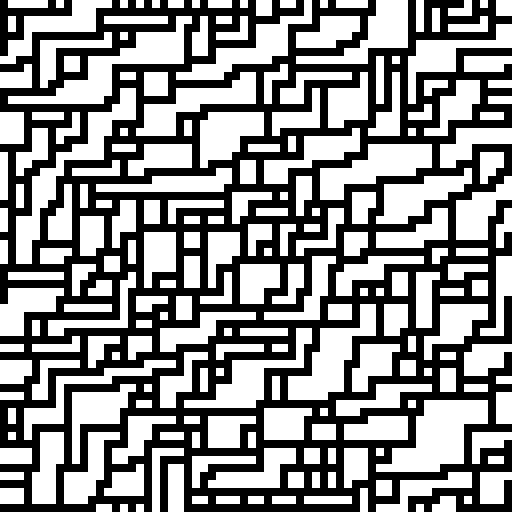 |

Le solveur reproduit les motifs locaux du sample (diagonales 0/1, zones
contiguës de 1, transitions). Pas de contradiction sur 5 attempts.

### `binary_stripes`, pattern très contraint

Bandes verticales 0/1 alternées. Avec N=2, 2 tuiles uniques.

| Input (8×8) | Output 48×48 N=2 seed=1 |
|---|---|
|  |  |

Le solveur converge vers le même motif (à un décalage de phase près).
Cas dégénéré utilisé par `test_overlap` pour vérifier l'identité des
règles.

### `binary_checker`, damier

Damier 0/1 avec N=2 → 2 tuiles uniques. Comme stripes mais avec
contraintes croisées.

| Input (8×8) | Output 48×48 N=2 seed=2 |
|---|---|
| 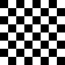 | 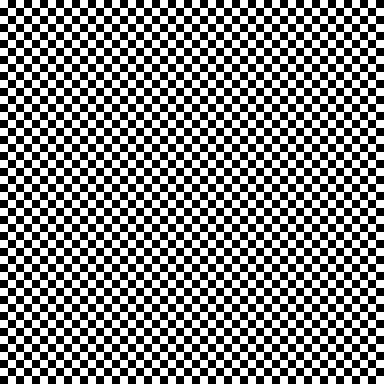 |

### `binary_dots`, points isolés

Sample où des `1` isolés sont entourés de `0`. Plus de tuiles uniques
(7) → grille plus variée.

| Input (10×10) | Output 64×64 N=2 seed=3 |
|---|---|
| 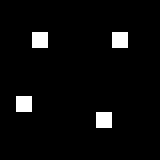 | 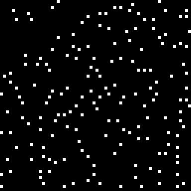 |

## Échantillons multi-valeurs

### `multivalue_terrain`, eau / sable / herbe / roche

Quatre valeurs (0=eau, 3=sable, 4=herbe, 5=roche) en couches concentriques.
33 tuiles uniques avec N=2. Sample qui montre que le solveur fonctionne
indépendamment du nombre de valeurs.

| Input (14×10) | Output 64×64 N=2 seed=7 | Output 128×128 N=2 seed=11 |
|---|---|---|
| 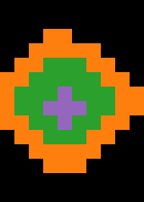 | 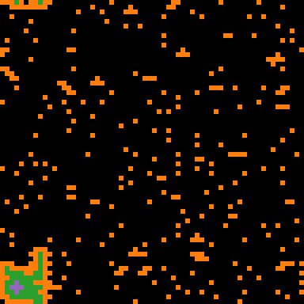 | 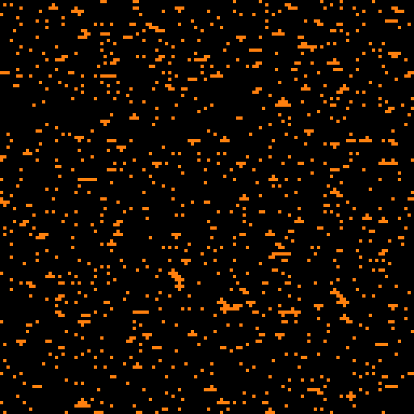 |

À 128×128, plusieurs îles indépendantes apparaissent : la zone est plus
grande que dans l'échantillon, et le solveur reproduit uniquement les
transitions locales (eau→sable→herbe→roche), il ne sait pas qu'il doit
faire une seule île.

### `multivalue_maze`, labyrinthe avec portes

Trois valeurs (0=sol, 1=mur, 6=porte). Sample 11×12 issu du fichier
`samples/multivalue_maze.txt`. Avec N=3 ce sample est connu pour
échouer fréquemment (utilisé comme test de failure path dans
`test_edge_cases`).

| Input (11×12) | Output 48×48 N=2 seed=13 |
|---|---|
|  | 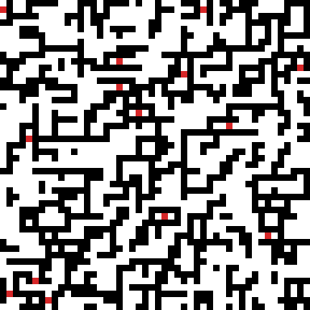 |

### `multivalue_smooth`, transitions douces

Sample avec gradients lisses entre valeurs.

| Input (12×12) | Output 64×64 N=2 seed=17 | Output 64×64 N=3 seed=19 |
|---|---|---|
| 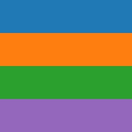 | 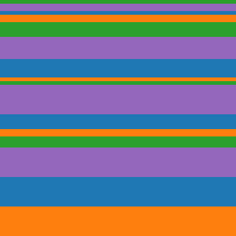 | 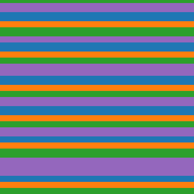 |

Augmenter N (2 → 3) capture des motifs locaux plus précis : la sortie
reproduit mieux les courbes de transition, au prix d'un tile set plus
gros et d'un solveur plus lent.

## Galerie style WFC paper (skyline / plant / rooms)

Échantillons inspirés des images les plus classiques du papier WFC
original (Maxim Gumin) : un skyline urbain, une plante avec fleurs,
et un dungeon binaire à pièces rectangulaires. Tous tournés à N=3
pour capturer les motifs locaux fins (fenêtres, branches, coins de
pièces) ; le taux de contradiction de N=3 est absorbé par
`--parallel-attempts 8` qui ramène le temps réel à celui d'un seul
attempt.

### `skyline`, ville nocturne

4 valeurs : ciel noir, immeubles gris, fenêtres jaunes, fondations
brunes. WFC apprend les motifs de fenêtre dans la maçonnerie, les
silhouettes verticales et la séparation ciel/sol.

| Input (16×14) | Seed 1 | Seed 7 | Seed 42 |
|---|---|---|---|
| 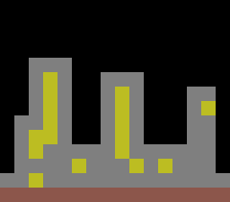 | 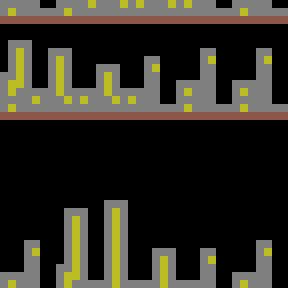 | 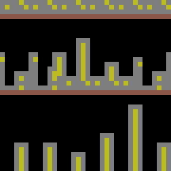 | 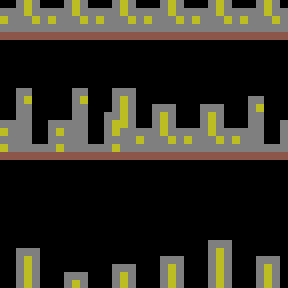 |

### `plant`, jardin de fleurs

4 valeurs : ciel bleu pâle, tiges vertes, fleurs jaunes, sol brun.
Les plantes croissent depuis le sol avec branches et fleurs aux
extrémités. Plusieurs spécimens dans l'échantillon → variété dans la
sortie.

| Input (16×15) | Seed 1 | Seed 7 | Seed 42 |
|---|---|---|---|
| 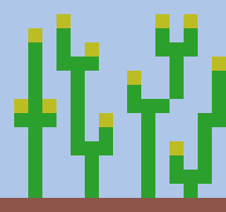 | 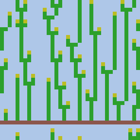 | 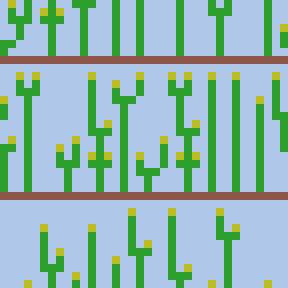 | 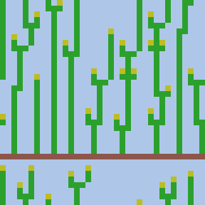 |

### `rooms`, dungeon binaire

2 valeurs : noir (mur), blanc (pièce). Sample contient des pièces
rectangulaires reliées par couloirs étroits. Sortie : layout de
dungeon plausible avec pièces de taille variable.

| Input (12×12) | Seed 1 | Seed 7 | Seed 42 |
|---|---|---|---|
| 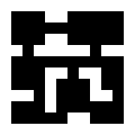 | 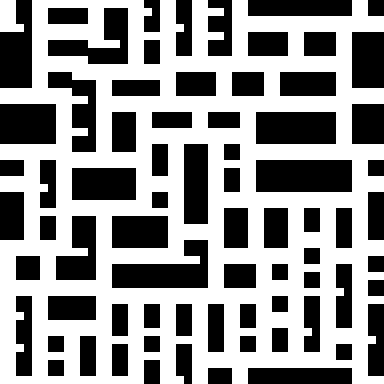 | 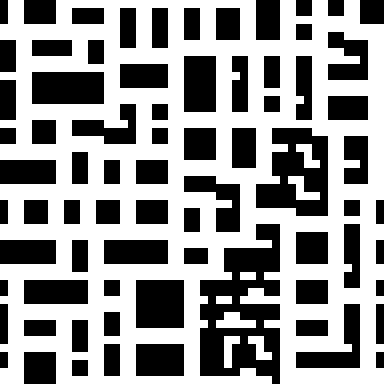 | 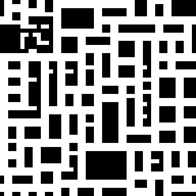 |

Le script `scripts/render_gallery.sh` produit les 9 sorties + les 3
thumbnails d'entrée :

```bash
./scripts/render_gallery.sh build
```

## Effet du déterminisme

Pour un même seed, tous les backends produisent la même grille au bit
près. Vérifié par les tests `test_solver_omp` et `test_solver_kokkos`
qui comparent par hash SHA-256 :

```bash
.\build\wfc_serial.exe samples/binary_5x5.txt --rows 32 --cols 32 -N 2 \
    --seed 42 --out out_serial.txt
.\build\wfc_omp.exe samples/binary_5x5.txt --rows 32 --cols 32 -N 2 \
    --seed 42 --threads 8 --out out_omp.txt
diff out_serial.txt out_omp.txt   # identique
```

C'est garanti par le `cell_jitter` SplitMix64 déterministe et la
réduction min-entropie en ordre de chunk fixe, voir [CHOICES.md](CHOICES.md).

## Résolution de l'exemple du sujet

Le sample `binary_5x5` est l'exemple littéral du `README.pdf`.
Reproduction du diagramme ASCII du sujet (figure 1 du README, page 2) :

```
1 0 1 1 1
1 0 1 1 1
0 0 1 1 1
0 1 1 1 1
0 0 0 0 0
```

Le solveur extrait correctement les 7 tuiles distinctes mentionnées
(en supplément des 4 tuiles supplémentaires créées par le wrap toroïdal,
soit 11 au total, voir `test_tileset.cpp` pour la vérification).
La grille 64×64 ci-dessus en est une instance solvée déterministe.

## Reproduire toute la galerie

```powershell
$env:Path = "C:\msys64\ucrt64\bin;$env:Path"
cmake -B build -G Ninja -DCMAKE_BUILD_TYPE=Release -DUSE_OMP=ON -DUSE_LTO=ON
cmake --build build -j
python scripts/render_input.py samples/*.txt
# puis pour chaque output :
.\build\wfc_serial.exe samples/binary_5x5.txt --rows 64 --cols 64 -N 2 \
    --seed 42 --scale 8 --png docs/figures/results/binary_5x5_64x64_N2_seed42.png
```
